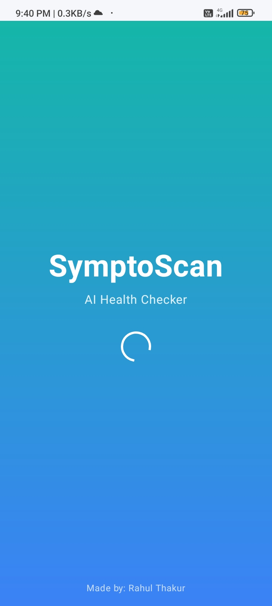
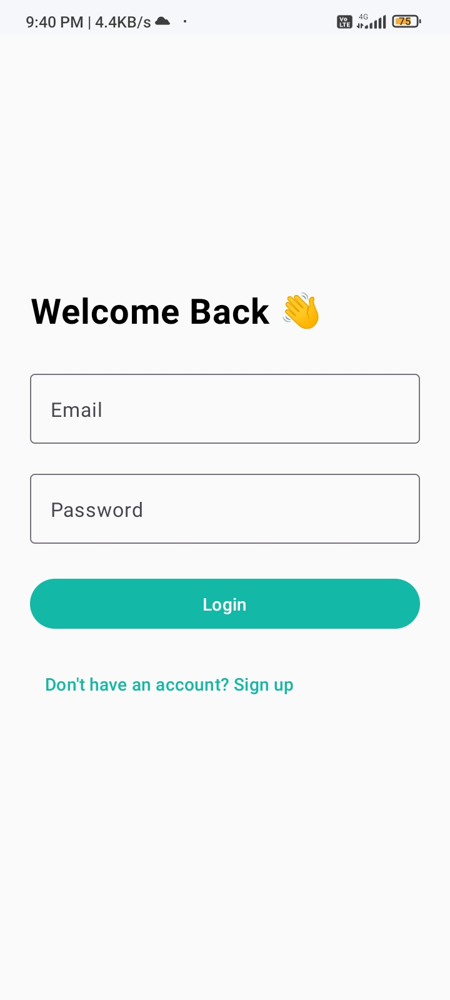
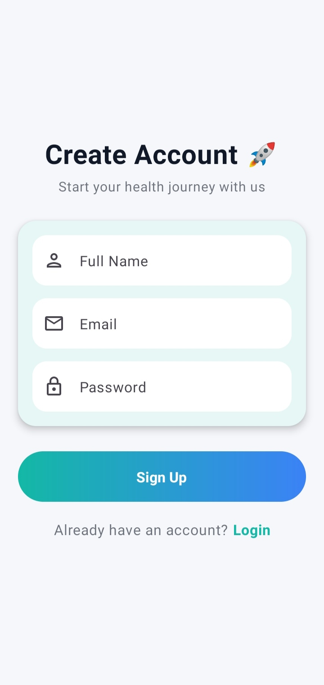
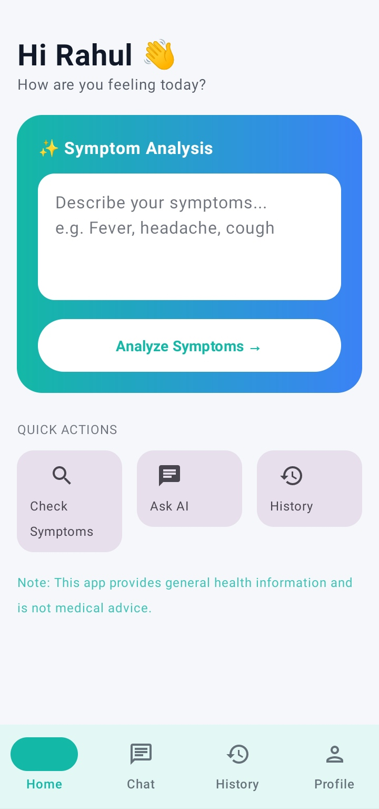
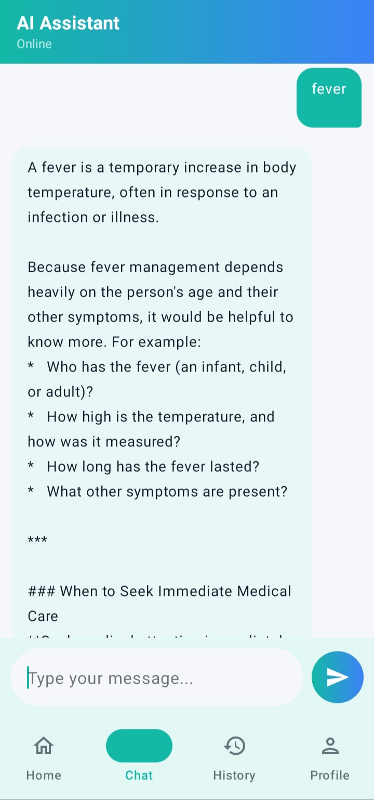
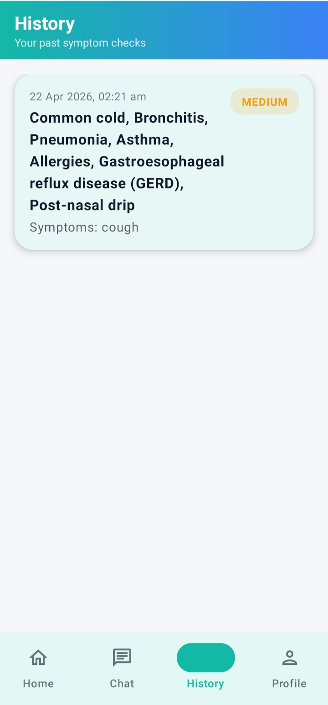
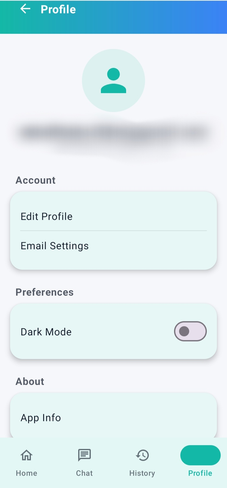

# 🩺 SymptoScan - AI Health Checker

<p align="center">
  
  
  
  
</p>

<p align="center">
  <b>AI-powered Android Health Assistant built using Kotlin, Jetpack Compose, Firebase, Room Database, and Gemini AI.</b>
</p>

---

## ✨ Overview

SymptoScan helps users analyze symptoms using AI and receive possible health insights instantly. The application provides AI-powered conversations, symptom history tracking, risk-level assessment, and a modern user experience built with Jetpack Compose.

---

## 🚀 Features

* 🤖 AI-Powered Symptom Analysis
* 💬 Chat with Gemini AI Assistant
* 📊 Risk Level Detection (Low / Medium / High)
* 🕒 Symptom History Tracking
* 🔐 Firebase Authentication
* ☁️ Cloud Storage with Firebase
* 🌙 Dark Mode Support
* 🎨 Modern Jetpack Compose UI
* ⚡ Fast & Responsive Experience

---

## 🛠️ Tech Stack

| Technology         | Purpose               |
| ------------------ | --------------------- |
| Kotlin             | Programming Language  |
| Jetpack Compose    | Modern UI Development |
| MVVM               | Architecture Pattern  |
| Firebase Auth      | Authentication        |
| Firebase Firestore | Cloud Database        |
| Room Database      | Local Storage         |
| Retrofit           | Network Requests      |
| Gemini API         | AI Symptom Analysis   |

---

## 📸 Application Screenshots

<table>
<tr>
<td align="center">
<br>
<b>Splash Screen</b>
</td>

<td align="center">
<br>
<b>Login Screen</b>
</td>

<td align="center">
<br>
<b>Signup Screen</b>
</td>
</tr>

<tr>
<td align="center">
<br>
<b>Home Screen</b>
</td>

<td align="center">
<br>
<b>AI Chat Screen</b>
</td>

<td align="center">
<br>
<b>History Screen</b>
</td>
</tr>

<tr>
<td align="center">
<br>
<b>Profile Screen</b>
</td>
</tr>
</table>

---

## 📂 Screenshots Folder

```text
screenshots
├── splash_screen.jpeg
├── login_screen.jpeg
├── signup_screen.jpeg
├── home.jpeg
├── chat.jpeg
├── history.jpeg
└── profile.jpeg
```

---

## ⚙️ Installation

### Clone Repository

```bash
git clone https://github.com/RahulThakur-28/SymptoScan.git
```

### Open in Android Studio

```text
1. Clone the repository
2. Open in Android Studio
3. Sync Gradle
4. Add Gemini API Key
5. Run the application
```

### API Key Setup

Create or update your `local.properties` file:

```properties
GEMINI_API_KEY=YOUR_API_KEY
```

---

## ⚠️ Disclaimer

This application provides AI-generated health information for educational purposes only and should not be considered professional medical advice.

Always consult a qualified healthcare professional for medical concerns.

---

## 🎯 Future Enhancements

* 🩺 Doctor Recommendation System
* 📍 Nearby Hospitals Integration
* 📈 Health Analytics Dashboard
* 🌐 Multi-language Support
* ⌚ Wearable Device Integration

---

## 👨‍💻 Developer

### Rahul Thakur

* Android Developer
* Kotlin & Jetpack Compose Enthusiast
* DSA & Problem Solving

GitHub: https://github.com/RahulThakur-28

---

## ⭐ Support

If you found this project useful, please consider giving it a ⭐ on GitHub.

Your support motivates future improvements and open-source development.
