<div align="center">


# 🩺 SymptoScan


### **AI Health Assessment Platform for Android**

*Structured symptom assessment, AI-generated follow-up questions, risk scoring, health guidance, assessment history, and an AI Health Assistant.*

<p align="center">


</p>

<p align="center">
<a href="https://github.com/RahulThakur-28/SymptoScan"><strong>GitHub Repository</strong></a>
</p>

</div>

---

# 📖 Overview

**SymptoScan** is an AI-assisted Android application built with **Kotlin** and **Jetpack Compose** for structured symptom assessment and general health guidance.

The application guides users through a complete assessment workflow:

```text
Symptoms
   ↓
Symptom Details
   ↓
Health Context
   ↓
AI Follow-up Questions
   ↓
User Answers
   ↓
AI Assessment Result
   ↓
Risk Score + Guidance
   ↓
Saved Assessment History
```

The backend uses **Supabase, PostgreSQL, Authentication, Storage, and Edge Functions**, while AI processing is handled through the **Gemini API**.

> ⚠️ **Medical Disclaimer:** SymptoScan is intended for general educational and informational purposes. It does not provide a definitive medical diagnosis, prescribe medication, or replace evaluation by a qualified healthcare professional. For urgent or emergency symptoms, seek professional medical care immediately.

---

# 🚀 Key Highlights

- 📱 Modern Android application built with **Kotlin + Jetpack Compose**
- 🤖 Gemini-powered follow-up questions and assessment guidance
- 📊 **0–100 assessment risk score**
- ☁️ Supabase backend with PostgreSQL persistence
- ⚡ Server-side AI processing using Supabase Edge Functions
- 🔐 Authentication and user-scoped data access
- 🛡️ Row Level Security (RLS)
- 💬 AI Health Assistant with conversation history
- 📚 Persistent assessment history
- 🧩 **15+ Compose screens**
- ♻️ **12+ reusable UI components**
- 🏗️ MVVM + Repository-based architecture

---

# ✨ Features

## 🔐 Authentication

- User registration
- Login
- Email verification
- Forgot password
- Persistent session
- Explicit logout
- Authentication state handling
- Form validation
- User-scoped data access
- Safe user-facing authentication errors

---

## 👤 Health Profile

Users can maintain relevant health information that can be used as assessment context.

- Full name
- Date of birth / age
- Biological sex
- Blood group
- Height
- Weight
- Allergies
- Existing medicals conditions
- Current medicines

---

## 🩺 AI Health Assessment

- Select multiple symptoms
- Symptom severity
- Pain level
- Duration
- Frequency
- Onset
- Additional notes
- Optional image context
- AI-generated follow-up questions
- Follow-up answer collection
- AI-generated assessment result
- Warning signs
- Urgency level
- General recommendations
- **0–100 risk score**

---

## 🤖 Assessment Result

The final assessment can provide:

- Summary
- Possible causes / explanations
- General recommendations
- Warning signs
- Urgency level
- Medical disclaimer
- **0–100 risk score**

### Risk Score

```text
0   → Lowest overall risk
100 → Highest overall risk
```

The risk score is persisted with the assessment result and displayed consistently across Result and History flows.

---

## 📚 Assessment History

- View previous assessments
- Search assessments
- Filter by risk level
- Assessment timestamps
- Open saved reports
- View persisted risk scores
- Assessment-specific result retrieval

---

## 🤖 AI Health Assistant

- Ask general health and wellness questions
- AI-generated responses
- Conversation history
- Open previous conversations
- Start new conversations
- Delete conversations
- Message persistence
- Safe error and recovery handling

---

## 🏠 Home

- Health overview
- Recent assessment
- Health Score
- Quick actions
- New Assessment
- Assessment History
- AI Assistant
- Profile access

---

## 👤 Profile & Settings

- Profile overview
- Edit Profile
- Medical Records
- Notifications
- Privacy & Security
- Terms of Service
- Help & Support
- Session management

---

# 📊 Project Statistics

| Category | Details |
|----------|---------|
| 📱 Platform | Android |
| 💻 Language | Kotlin |
| 🎨 UI | Jetpack Compose + Material 3 |
| 🏗 Architecture | MVVM + Repository Pattern |
| ☁️ Backend | Supabase |
| 🗄 Database | PostgreSQL |
| ⚡ Serverless | Supabase Edge Functions |
| 🤖 AI | Gemini API |
| 🔐 Authentication | Supabase Authentication |
| 🛡️ Security | Row Level Security (RLS) |
| 💉 Dependency Injection | Hilt |
| 🔄 Async | Kotlin Coroutines |
| 📡 State | StateFlow |
| 🖼 Storage | Supabase Storage |
| 📱 Compose Screens | 15+ |
| ♻️ Reusable Components | 12+ |

---

# 🏗️ Architecture

```text
                    PRESENTATION
┌─────────────────────────────────────────────┐
│ Jetpack Compose Screens                     │
│ Components • Navigation • ViewModels       │
└──────────────────────┬──────────────────────┘
                       │
                       ▼
                 StateFlow / UI State
                       │
                       ▼
                 REPOSITORY LAYER
┌──────────────────────┼──────────────────────┐
│                      │                      │
▼                      ▼                      ▼
Auth               Assessment            AI Assistant
│                      │                      │
└──────────────────────┼──────────────────────┘
                       │
                       ▼
                     SUPABASE
┌──────────────────────┼──────────────────────┐
│                      │                      │
▼                      ▼                      ▼
Authentication      PostgreSQL             Storage
                       │
                       ▼
                 Edge Functions
                       │
                       ▼
                   Gemini API
```

---

# 📂 Project Structure

```text
SymptoScan/
│
├── app/
│   └── src/
│       └── main/
│           ├── java/
│           │   └── com/rahul/symptoscan/
│           │       ├── core/
│           │       ├── data/
│           │       ├── domain/
│           │       ├── navigation/
│           │       ├── presentation/
│           │       └── ui/
│           └── res/
│
├── screenshots/
│   ├── app_logo.png
│   ├── splash.jpeg
│   ├── Login.jpeg
│   ├── registration.jpeg
│   ├── home.jpeg
│   ├── assesment.jpeg
│   ├── ques.jpeg
│   ├── result.jpeg
│   ├── his.jpeg
│   ├── ai_ass.jpeg
│   ├── profile.jpeg
│   ├── sett.jpeg
│   ├── pdf.jpeg
│   └── dark.jpeg
│
├── supabase/
│   └── functions/
│       ├── generate-assessment-questions/
│       │   └── index.ts
│       └── generate-assessment-result/
│           └── index.ts
│
└── README.md
```

---

# 🗄️ Database

The main PostgreSQL tables include:

| Table | Purpose |
|------|---------|
| `assessments` | Assessment lifecycle and core assessment data |
| `assessment_symptoms` | Selected symptoms and symptom details |
| `assessment_questions` | AI-generated questions and user answers |
| `assessment_results` | Final assessment result and risk score |
| `health_profiles` | User health profile |
| `health_conversations` | AI Assistant conversation metadata |
| `health_messages` | AI Assistant messages |

### Assessment Result Fields

```text
summary
possible_causes
recommendations
warning_signs
urgency_level
disclaimer
risk_score
```

---

# 🧠 AI Workflow

## Follow-up Question Generation

```text
Assessment
    ↓
Symptoms + Details
    ↓
Health Context
    ↓
Supabase Edge Function
    ↓
Gemini API
    ↓
Structured Follow-up Questions
    ↓
PostgreSQL
    ↓
Android UI
```

## Final Assessment Result

```text
Symptoms
    +
Symptom Details
    +
Health Context
    +
Follow-up Answers
    ↓
Supabase Edge Function
    ↓
Gemini API
    ↓
Structured JSON Result
    ↓
Risk Score Validation
    ↓
PostgreSQL
    ↓
Assessment Result
```

## AI Health Assistant

```text
User Question
      ↓
ViewModel
      ↓
Repository
      ↓
AI Backend
      ↓
Gemini API
      ↓
Response
      ↓
Conversation Persistence
      ↓
Compose UI
```

---

# 🏆 Technical Highlights

- **MVVM + Repository Pattern** for separation of concerns
- **Jetpack Compose** for modern UI development
- **StateFlow** for reactive UI state
- **Hilt** for dependency injection
- **Kotlin Coroutines** for asynchronous operations
- **Supabase Authentication** for account/session management
- **PostgreSQL** for persistent health and assessment data
- **Supabase Edge Functions** for server-side AI processing
- **Gemini API** for structured AI assessment workflows
- **RLS** for user-scoped database access
- Structured AI response validation and risk-score validation
- Assessment-specific result persistence and recovery

---

# 📱 Application Screens

| Module | Screens |
|--------|---------|
| Authentication | Splash, Onboarding, Login, Register, Email Verification, Forgot Password |
| Home | Dashboard, Quick Actions |
| Assessment | Assessment, Symptom Details, Follow-up Questions, Assessment Result |
| History | Assessment History, Assessment Report |
| AI Assistant | Assistant Chat, Conversation History, Conversation Detail |
| Profile | Profile, Edit Profile, Medical Records |
| Settings | Notifications, Privacy & Security, Terms, Help & Support |

---

# 📸 Application Screenshots


| Splash | Login | Registration |
|:------:|:-----:|:------------:|
| 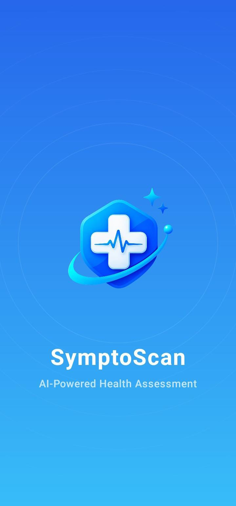 | 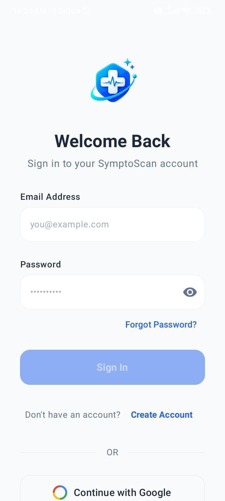 | 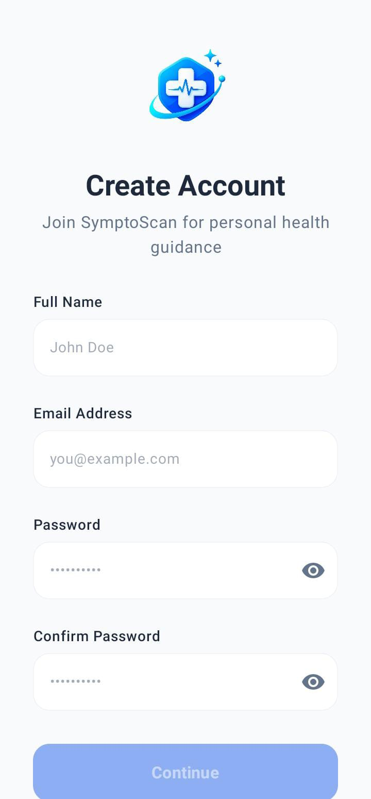 |

| Home | Assessment | Follow-up Questions |
|:----:|:----------:|:-------------------:|
| 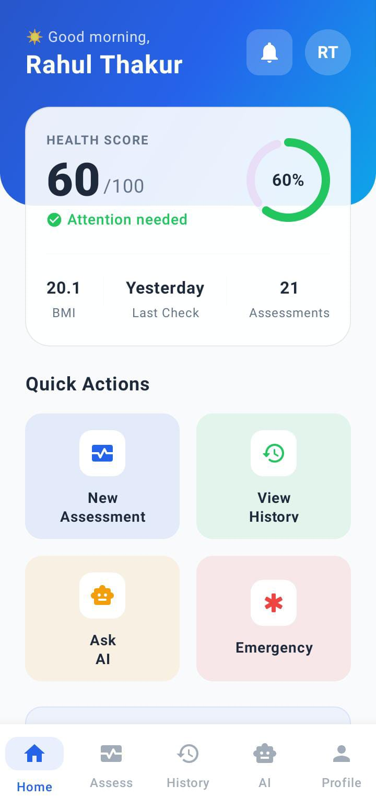 | 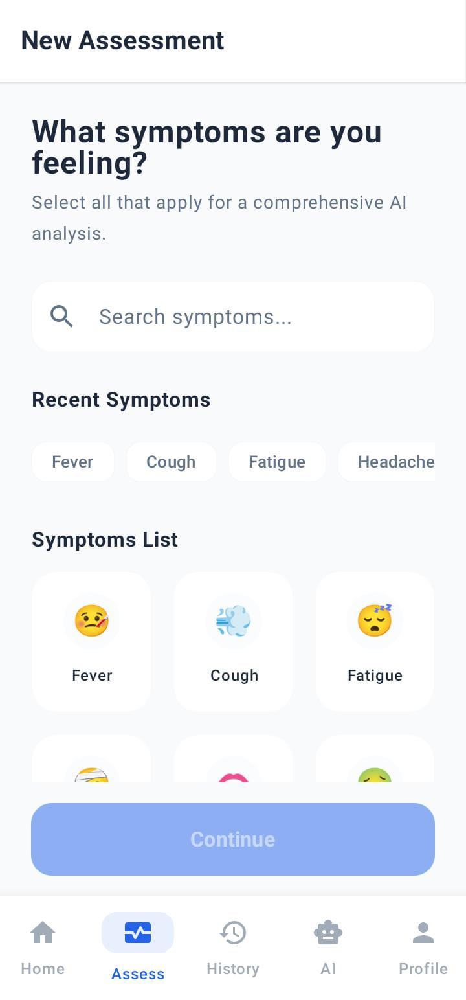 | 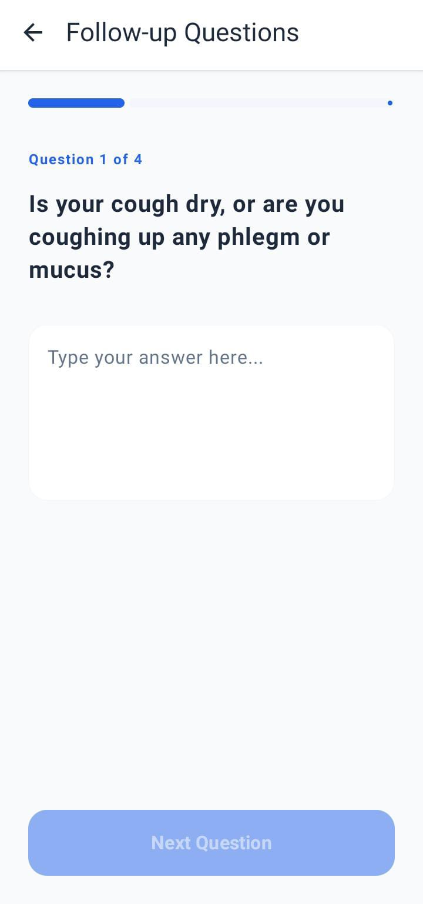 |

| Result | History | AI Assistant |
|:------:|:-------:|:------------:|
| 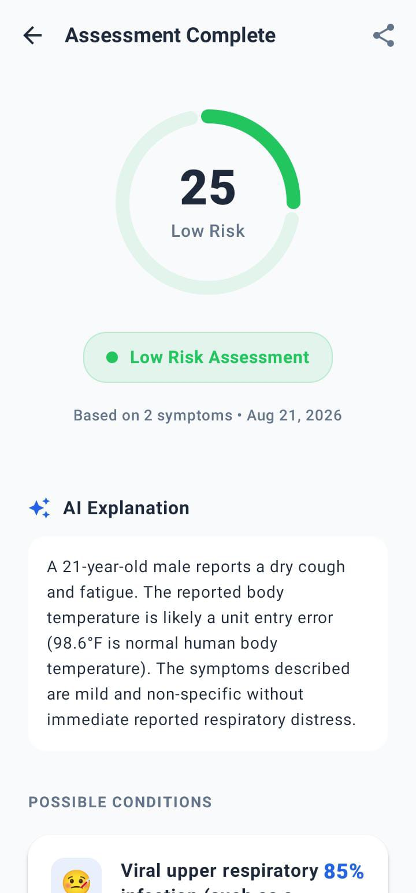 | 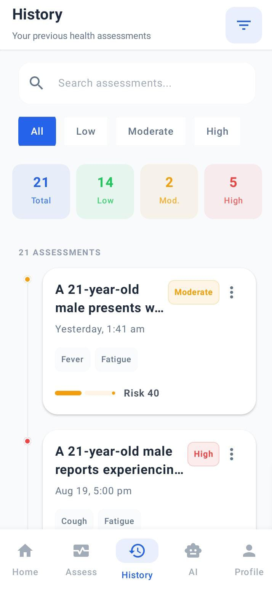 | 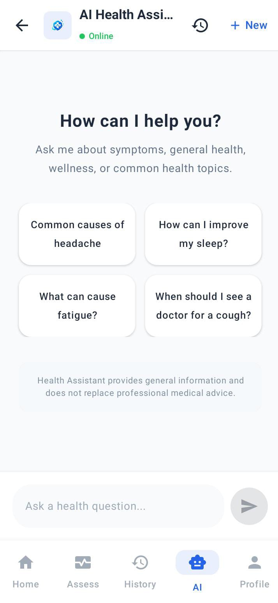 |

| Profile | Settings | Generate Pdf  |
|:-------:|:--------:|:------------------:|
| 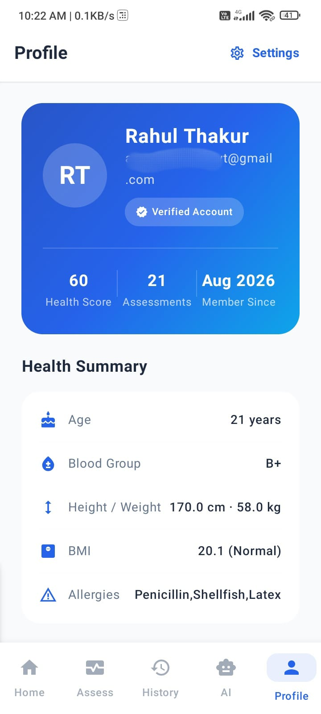 | 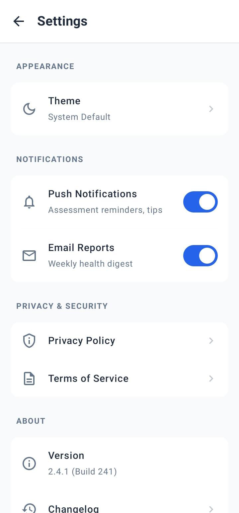 | 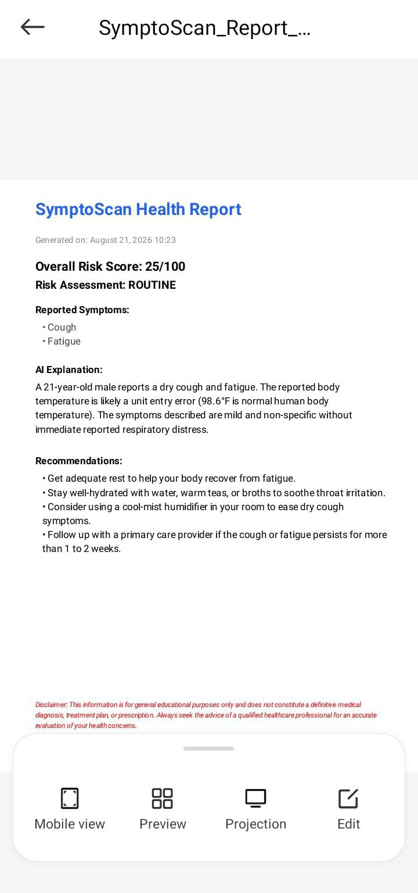 |

| Dark Theme |
|:----------:|
| 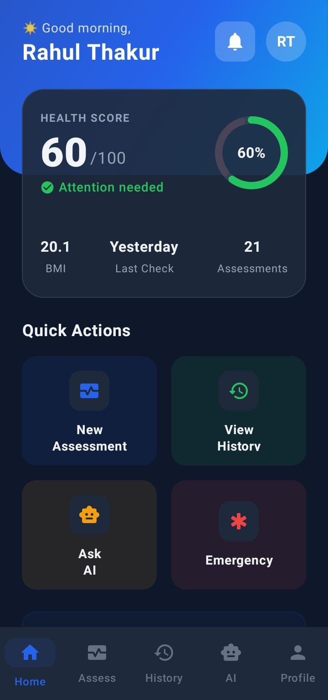 |
# ⚙️ Getting Started

## Prerequisites

- Android Studio
- JDK compatible with the project configuration
- Git
- Supabase CLI

## Clone Repository

```bash
git clone https://github.com/RahulThakur-28/SymptoScan.git
cd SymptoScan
```

## Open Project

Open the project in Android Studio and allow Gradle synchronization to complete.

## Configure Environment

Keep local secrets outside Git.

Typical client configuration:

```text
SUPABASE_URL
SUPABASE_ANON_KEY
```

Server-side Edge Function secrets:

```text
GEMINI_API_KEY
SUPABASE_SERVICE_ROLE_KEY
```

> **Important:** Never commit private credentials or the Supabase service-role key to the repository.

---

# 🚀 Supabase Setup

Login:

```bash
supabase login
```

Link the project:

```bash
supabase link --project-ref YOUR_PROJECT_REF
```

Deploy assessment question generation:

```bash
supabase functions deploy generate-assessment-questions
```

Deploy assessment result generation:

```bash
supabase functions deploy generate-assessment-result
```

Verify deployed functions:

```bash
supabase functions list
```

---

# 🔨 Build & Run

### Windows

```powershell
.\gradlew.bat assembleDebug
```

### macOS / Linux

```bash
./gradlew assembleDebug
```

Connect an Android device or emulator and run the application from Android Studio.

---


# 🤝 Contributing

Contributions and suggestions are welcome.

```text
1. Fork the repository
2. Create a feature branch
3. Implement and test your changes
4. Commit your changes
5. Open a Pull Request
```

Example:

```bash
git checkout -b feature/your-feature
git add .
git commit -m "feat: add your feature"
git push origin feature/your-feature
```

---

# 👨‍💻 Developer

## Rahul Thakur

**Android Developer | Kotlin | Jetpack Compose | AI Integration**

GitHub:

https://github.com/RahulThakur-28

---

# ⭐ Support

If you find **SymptoScan** useful:

⭐ Star the repository  
🍴 Fork the project  
🐛 Report issues  
💡 Suggest improvements

---

<div align="center">

### 🩺 Built with Kotlin, Jetpack Compose, Supabase & Gemini AI

**SymptoScan — AI-Assisted Health Assessment Platform**

</div>
